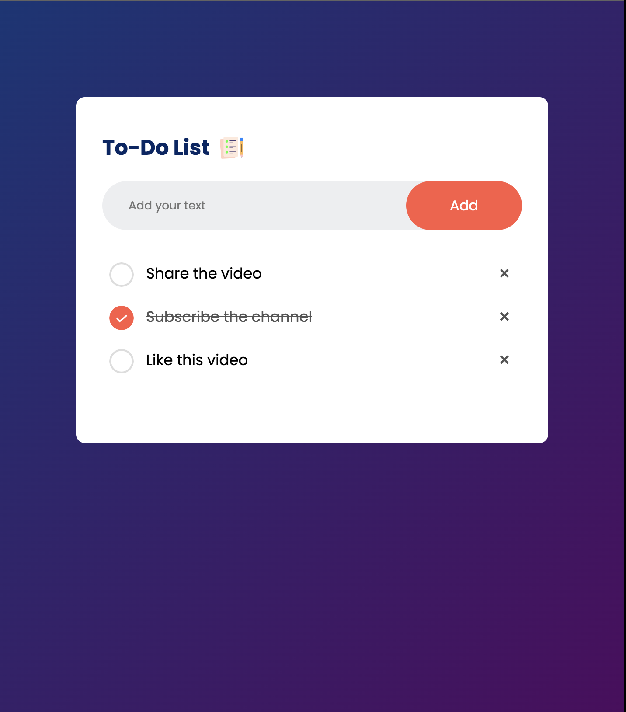

# To-Do App 

It is a aesthetically pleasing, user-friendly to-do application developed using pure JavaScript.

## Table of contents

- [Overview](#overview)
  - [The challenge](#the-challenge)
  - [Screenshot](#screenshot)
  - [Links](#links)
- [My process](#my-process)
  - [Built with](#built-with)
  - [What I learned](#what-i-learned)
  - [Continued development](#continued-development)
  - [Useful resources](#useful-resources)
- [Author](#author)
- [Acknowledgments](#acknowledgments)


## Overview

### The challenge

It involves creating a to-do app using vanilla Javascript coupled with html and css.

### Screenshot

The screenshot below shows how it looks:




### Links

- Solution URL: [Add solution URL here](https://github.com/richard9809/todo-js)
- Live Site URL: [Add live site URL here](https://animated-speculoos-444fb9.netlify.app)

## My process

### Built with

- Semantic HTML5 markup
- CSS custom properties
- Flexbox
- Mobile-first workflow
- Javascript
- The Movie Database API


### What I learned

During this project, I learned how to implement Javascript Local storage and save the todos.

```js
function saveData() {
  localStorage.setItem("data", listContainer.innerHTML);
}

function showTask() {
  listContainer.innerHTML = localStorage.getItem("data");
}
```

I also learnt how to use the before pseudo classes.

```css
ul li::before {
  content: '';
  position: absolute;
  height: 28px;
  width: 28px;
  border-radius: 50%;
  background-image: url(images/unchecked.png);
  background-size: cover;
  background-position: center;
  top: 12px;
  left: 8px;
}
```

### Continued development

I plan to continue refining my skills in creating responsive designs and enhancing user interactions with more advanced CSS features.


### Useful resources

- [MDN Web Docs](https://developer.mozilla.org/en-US/) - An excellent resource for HTML, CSS, and JavaScript documentation.

## Author

- Frontend Mentor - [@richard9809](https://www.frontendmentor.io/profile/richard9809)
- Twitter - [@rmulu333](https://www.twitter.com/rmulu333)

## Acknowledgments

I'd like to acknowledge the helpful resources and support. This project allowed me to practice and improve my web development skills.

